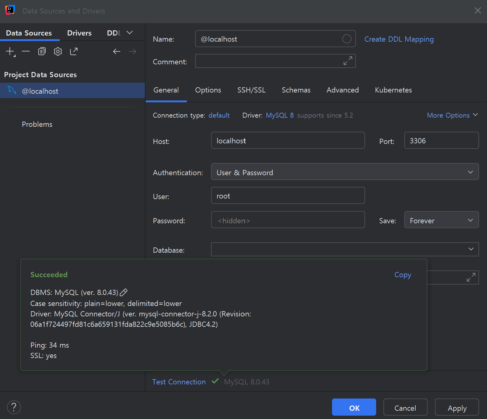

# WEEK 0 - 제이/한종서

## 핵심 키워드

### 외래키

- 외래키(Foreign Key)는 한 테이블의 열(Column)이 다른 테이블의 기본키(Primary Key)나 고유키(Unique Key)를 **참조**하는 Column이다.
- **두 테이블 간의 관계(Relationship)를 표현**하며, **다른 테이블에 존재해야 사용 가능**하기 때문에 잘못된 참조 데이터가 입력되지 않도록 막아 **데이터의 무결성을 유지하도록 강제**한다.
- 하나의 테이블은 여러 개의 외래키를 가질 수 있고, 여러 개의 Column을 묶어 하나의 외래키(복합 외래키)로도 지정할 수 있다.

### 기본키

- 기본키(Primary Key)는 관계형 데이터베이스(RDBMS)에서 **테이블의 각 행(Row)을 고유하게 식별하는 Column**이다.
- 중복 값을 허용하지 않는다.
- NULL 값을 허용하지 않는다.
- 하나의 테이블에는 기본키가 하나만 존재한다. 다만, 여러 Column을 묶어 복합 기본키(Composite PK)로 지정할 수 있다.
- 외래키(FK)에서 참조 대상이 되는 대표적인 Column이다.

#### 예시
```sql
CREATE TABLE user (
    id bigint PRIMARY KEY, -- 기본키
    name VARCHAR(20) NOT NULL,
    email VARCHAR(255) UNIQUE
);
```

### ER 다이어그램

- ERD(Entity-Relationship Diagram)는 데이터베이스를 설계할 때 현실 세계의 **개체(Entity), 속성(Attribute), 관계(Relationship)를 시각적으로 표현한 것**이다.
- 피터 첸(Peter Chen)이 1976년에 제안한 개념적 데이터 모델에서 시작됐다.

| 구성 요소              | 설명                     | 기호 |
|--------------------|------------------------|----|
| 엔터티(Entity)        | 저장해야 할 대상(사물, 개념, 사건 등) | 사각형 |
| 속성(Attribute)      | 엔터티가 가지는 세부 정보(컬럼)     | 타원 |
| 관계(Relationship)   | 엔터티 간의 연관성             | 마름모 |
| 키(Key)             | 엔터티를 유일하게 식별하는 속성 → PK | 밑줄 |
| 카디널리티(Cardinality) | 관계의 참여 수(1:1, 1:N, N:M) | 선 또는 숫자 |

### 복합키

- 복합키(Composite Key)는 **관계형 데이터베이스에서 여러 컬럼을 묶어 하나의 기본키처럼 사용하는 키**이다.
- **단일 컬럼만으로는 각 행을 고유하게 식별할 수 없을 때 사용**된다.
- 일반적으로 다대다(N:M) 관계 테이블에서 많이 사용한다.

#### 예시

`address` 테이블에는 여러 속성이 있다.

- street(도로명)
- city(도시)
- state(주/도)
- postal_code(우편번호)

한 컬럼만으로는 유일하게 주소를 식별할 수 없다고 가정하면, 여러 개의 컬럼을 결합하여 유일성을 보장할 수 있다.

```sql
CREATE TABLE address (
    street VARCHAR(100),
    city VARCHAR(50),
    state VARCHAR(50),
    postal_code VARCHAR(20),
    PRIMARY KEY (street, city, state, postal_code) -- 복합키
);
```

### 연관관계

- **두 개 이상의 엔터티(Entity) 사이의 논리적 연결**을 의미한다.
- ERD에서 **마름모**로 표현한다.
- 1:1, 1:N, N:M 관계 형태가 있다.

#### 1:1 관계

한 엔터티의 레코드가 다른 엔터티의 한 레코드와만 연결된다. 예를 들어, 상점과 주소를 들 수 있다.

#### 1:N 관계

일대다/다대일 관계는 한 엔터티의 레코드가 다른 엔터티의 여러 레코드와 연결된다. 즉, 하나의 원소가 두 개 이상의 원소와 관계를 맺는 것을 의미한다. 예를 들어, 지도 교수와 학생을 들 수 있다. 하나의 지도 교수는 여러 명의 지도 학생을 둔다.

#### N:M 관계

다대다 관계는 여러 레코드가 서로 여러 레코드와 연결된다. 예를 들어, 학생과 수강 과목을 들 수 있다.

### 정규화

- **테이블이 올바른 형태가 아닐 때, 올바른 형태로 분해하는 것**
- 삽입, 삭제, 갱신 시 이상 현상이 발생할 수 있으므로 **테이블을 더 세분화하는 개념**이다.
- 제1 정규화: 스키마의 모든 Attribute가 atomic 해야 한다. 즉, 하나의 컬럼에는 하나의 값만 저장한다.
- 제2 정규화: 제1 정규형을 만족하면서 현재 테이블의 주제와 관련없는 컬럼을 다른 테이블로 빼야 한다. 어렵게 설명하면 완전 함수 종속이 되도록 해야 한다. 즉, 기본키가 여러 컬럼으로 이루어진 경우에 그 일부 컬럼에만 의존하는 상황(부분 함수 종속)을 제거한다.
- 제3 정규화: 제1, 2 정규형을 만족하면서 일반 컬럼에만 종속된 컬럼을 다른 테이블로 빼야 한다. 예를 들면, `A -> B`이고 `B -> C`일 때 `A -> C`도 성립하는데 이때 `C`가 `A`에 직접 종속된 것이 아니라 B를 거쳐 종속되어 있으므로 이를 분리해야 한다.

### 반정규화

- 정규화의 반대 개념으로, **정규화 과정에서 분리한 테이블을 성능 향상이나 편의성을 위해 다시 합치는 과정**이다.
- 데이터 중복을 허용하면서 쿼리 효율을 높이는 설계 기법이다.

#### 예시 상황

- JOIN 연산이 많은 경우, 일부 테이블을 합쳐 조회 속도를 개선할 수 있다.
- 테이블 수가 많은 경우, SQL이 복잡해질 수 있는데 이때 일부 컬럼을 중복 저장하여 복잡한 쿼리를 단순화할 수 있다.
- 집계, 분석용 테이블을 따로 만들어 빠른 조회를 할 수 있다.

### DB에서의 상속 관계 표현

- 관계형 DB는 테이블 간 계층 구조를 직접 지원하지 않기 때문에 상속을 테이블 설계로 변환해야 한다.
- 상속 표현 방법으로는 단일 테이블 전략, 클래스별 테이블 전략, 구체 클래스별 테이블 전략이 있다고 한다.

#### 단일 테이블 전략(Single Table Inheritance)

- **모든 클래스 속성을 한 테이블에 통합**한다.
- 자식 클래스 구분용 컬럼을 추가한다.
- JOIN 연산이 필요 없어 조회 성능이 좋지만, 많은 NULL이 발생하여 테이블 Sparsity가 증가할 수 있다.

#### 클래스별 테이블 전략(Class Table Inheritance)

- **부모 테이블과 자식 테이블을 별도로 생성**한다.
- 자식 테이블은 부모 테이블의 기본키를 외래키로 참조한다.
- NULL이 없기 때문에 구조가 명확하지만, 조회 시 JOIN 연산이 필요하므로 성능 저하가 일어날 수 있다.

#### 구체 클래스별 테이블 전략(Concrete Table Inheritance)

- **각 자식 클래스별 테이블만 생성**한다.
- 공통 속성도 각 테이블에 중복 저장한다.
- 조회 시 JOIN 연산이 필요 없어 조회 성능이 좋지만, 중복 데이터가 존재해 저장 공간이 증가하고, 갱신 이상 현상이 발생할 수 있다.

#### 정리

- 관계형 DB는 상속을 직접 지원하지 않기 때문에 설계 전략이 필요하다.
- 조회 성능, NULL 허용 여부, 데이터 중복 허용 여부를 선택 기준으로 잡을 수 있다.
- ERD 단계에서 상속을 고려하면, 테이블 설계 시 전략을 명확하게 선택할 수 있다.

### 인덱스

- 데이터베이스 테이블에서 검색 속도를 빠르게 하기 위해 별도로 생성하는 자료구조이다.
- 책의 목차, 색인과 유사하며 원하는 데이터를 바로 찾을 수 있도록 위치 정보를 저장한다.
- 효과: 검색 성능 향상, 정렬/JOIN 연산/그룹화 최적화

#### 인덱스 종류

| 종류                      | 설명                 | 특징/사용 예시                              |
|---------------------------|--------------------|---------------------------------------|
| 기본키 인덱스 (PK Index)   | 기본키 생성 시 자동 생성     | 유일성 보장, 클러스터형 가능                      |
| 고유 인덱스 (Unique Index) | 중복값 허용 안 함         | 이메일, 주민등록번호 등                         |
| 일반 인덱스 (Non-unique Index) | 중복값 허용             | 검색 성능 향상 목적                           |
| 복합 인덱스 (Composite Index) | 여러 컬럼을 묶어서 인덱싱     | (last_name, first_name) 같이 조건 결합 시 유리 |
| 부분/함수 인덱스            | 컬럼 일부 조건 또는 계산값 기준 | WHERE 조건이 자주 쓰이는 컬럼 최적화               |
| 클러스터형 인덱스 (Clustered) | 테이블 자체를 인덱스 순으로 정렬 | 한 테이블당 하나만 가능, 범위 검색 최적               |
| 비클러스터형 인덱스 (Non-clustered) | 별도 구조에 인덱스 저장      | 테이블의 원래 순서 유지, 다중 인덱스 가능              |

#### 장점

- 검색 속도 향상: WHERE, JOIN, ORDER BY, GROUP BY 시 효율적
- 정렬 성능 개선: ORDER BY, MIN/MAX 쿼리 최적화
- 무결성 강화: PK/Unique 제약 시 자동 인덱스 활용
- 범위 검색 최적화: BETWEEN, LIKE 관련 검색 성능 개선

#### 단점

- 쓰기 성능 저하: INSERT, UPDATE, DELETE 시 인덱스 갱신 필요
- 저장 공간 증가: 인덱스 자체를 별도로 저장하므로 디스크 사용량 증가
- 과도한 인덱스는 오히려 성능을 약화시킴: 너무 많은 컬럼에 인덱스를 적용하면 오히려 느려짐
- 복잡한 설계: 어떤 컬럼에 인덱스를 생성할지 판단이 필요함

#### 예시

고유 인덱스

```sql
CREATE UNIQUE INDEX idx_email
ON user(email);
```

복합 인덱스

```sql
CREATE INDEX idx_user_city_state
ON user(city, state);
```

#### 요약
- 인덱스는 검색 성능 향상을 위한 핵심 도구
- 쓰기 작업 시 성능 저하를 고려하여 필요한 컬럼에만 신중히 적용해야 한다.
- PK, Unique, 자주 조회되는 컬럼이나 자주 JOIN되는 컬럼에 우선 적용하면 판단이 쉽다.

## 실습 인증



## 미션


[ERD Cloud 주소](https://www.erdcloud.com/d/XnwBtokYELDsY7LEf)